# Banyan Architecture Diagrams

Visual representations of the Banyan system architecture at different scales and perspectives.

---

## 📐 Current Architecture (MVP)

```mermaid
flowchart TD
    A[User] --> B[Web App (Next.js 14)]
    B -->|Wizard (6 prompts)| C[/POST /api/generate-brief/]
    B -->|Vision V2 Generate/Refine/Score| D[/POST /api/vision-framework-v2/*/]

    subgraph AI[AI Pipeline]
      C --> R1[Model Router\n(GPT-4 / Gemini Pro / Flash)]
      D --> R1
      R1 --> V1[Zod Validation]
      V1 --> E1[Evaluation\n(QA + Quality Scores)]
    end

    E1 --> P1[Persistence\n(Postgres via Drizzle)]
    V1 --> P1

    subgraph DB[(PostgreSQL)]
      P1 --> DOCS[(documents JSONB)]
      P1 --> EVENTS[(lensEvents / eventsAudit)]
      P1 --> EMB[(visionEmbeddings)]
    end

    B <-->|Fetch/Stream| DOCS

    subgraph Lens[Founder's Lens]
      EVENTS --> L1[Aggregation & Reflections]
      EMB --> L2[Alignment Scoring]
      L1 --> B
      L2 --> B
    end

    subgraph Exports[Exports]
      B --> X1[Markdown]
      B --> X2[PDF (jsPDF + html2canvas)]
      B --> X3[Google Docs (future)]
    end

    subgraph Ops[Observability & Scale]
      B -. events .-> PH[(PostHog)]
      B -. errors .-> SE[(Sentry)]
      R1 -. long jobs .-> WQ[Inngest Workers\n(background generation)]
    end

    subgraph Auth[Auth]
      A --> CLERK[Clerk]
      CLERK --> B
      CLERK --> P1
    end
```

**Key Characteristics:**
- Single monolith on Vercel
- Synchronous AI generation (30-40s response time)
- Direct database connections
- Simple auth flow (anonymous → authenticated)

---

## 🚀 Future Architecture (500+ Users)

```mermaid
flowchart TD
    A[User] --> CDN[Vercel Edge CDN]
    CDN --> B[Next.js App\n(UI + API Gateway)]
    
    B -->|Job Request| Q[Job Queue\nInngest/BullMQ]
    Q --> W1[Worker Pool]
    Q --> W2[Worker Pool]
    Q --> W3[Worker Pool]
    
    W1 --> AI[AI Services]
    W2 --> AI
    W3 --> AI
    
    AI -->|GPT-4 High Quality| OAI[OpenAI API]
    AI -->|Refinements + Bulk| LLM[Self-Hosted\nLlama 3.1 70B]
    
    B <-->|Read| CACHE[(Redis Cache\n5min TTL)]
    CACHE <-->|Miss| DBR[(DB Read Replica)]
    B -->|Write| DBW[(DB Primary)]
    DBR -.->|Replication| DBW
    
    subgraph Observability
      B --> LOG[Structured Logs]
      W1 --> LOG
      W2 --> LOG
      W3 --> LOG
      LOG --> SE[Sentry]
      B --> PH[PostHog]
    end
    
    subgraph Auth & Permissions
      A --> CLERK[Clerk]
      CLERK --> B
      B --> MW[Middleware\nRBAC + RLS]
      MW --> DBW
      MW --> DBR
    end
    
    subgraph Storage
      B --> S3[S3/R2\nExported PDFs]
      B --> BLOB[Blob Storage\nLarge Documents]
    end
```

**Key Changes:**
- Async job processing (no timeouts)
- Worker pools for parallel AI operations
- Read/write database split
- Redis caching layer
- Hybrid AI strategy (cost optimization)
- File storage for exports

---

## 🔐 Permission Flow (Multi-Tenant)


**Permission Hierarchy:**
1. Direct ownership (always allow)
2. Organization membership + role
3. Explicit document shares
4. Deny by default

---

## 📊 Data Flow: Brief Generation


**Timing:**
- Input validation: <100ms
- AI generation: 15-20s (parallel calls)
- Quality scoring: 3-5s
- Database save: <200ms
- **Total: ~20-25 seconds**

---

## 🔄 Data Flow: Iterative Refinement

```mermaid
sequenceDiagram
    participant U as User Browser
    participant API as Refine API
    participant AI as AI Service
    participant DB as Database
    participant CACHE as Redis

    U->>U: Views section score: 5.2/10
    U->>U: Clicks "🎯 More Specific"
    
    U->>API: POST /api/vision-framework-v2/refine<br/>{section, action, currentContent}
    
    API->>CACHE: Get original responses
    alt Cache Hit
        CACHE-->>API: Return cached data
    else Cache Miss
        API->>DB: Fetch from DB
        DB-->>API: Original responses
        API->>CACHE: Store for 5min
    end
    
    API->>AI: Build refinement prompt
    Note over AI: Includes:<br/>- Current content<br/>- Original responses<br/>- Identified issues<br/>- Refinement action
    
    AI->>OpenAI: GPT-4 refinement
    OpenAI-->>AI: Refined content
    
    AI->>AI: Re-score section
    AI-->>API: {refinedContent, newScore}
    
    API->>DB: Update document
    API->>CACHE: Invalidate cache
    
    API-->>U: Return refined section
    U->>U: Update UI<br/>Show new score: 8.1/10
```



**Timing:**
- Cache lookup: <10ms
- AI refinement: 5-10s
- Re-scoring: 2-3s
- Database update: <200ms
- **Total: ~8-15 seconds**

---

## 🏢 Multi-Tenant Data Model


**Access Patterns:**
1. Get user's documents: `documents.user_id = ?`
2. Get org's documents: `documents.organization_id = ?`
3. Get shared documents: `JOIN document_shares ON ...`
4. Check permission: `organization_members.role >= required_role`

---

## 🔥 Error Handling Flow


**Error Response Format:**
```json
{
  "error": "AI generation timed out",
  "code": "AI_GENERATION_TIMEOUT",
  "statusCode": 500,
  "requestId": "req_abc123",
  "timestamp": "2025-10-05T14:30:00Z"
}
```

---

## 📈 Scaling Triggers & Actions


**Action Priority:**
1. Error rate → Immediate (quality issue)
2. Generation time → High (user experience)
3. DB CPU → High (prevents cascading failures)
4. API latency → Medium (performance)
5. Queue backlog → Medium (capacity)
6. AI cost → Low (financial optimization)

---

## 🧪 Testing Strategy


**Test Pyramid:**
- **Unit**: Run every commit (1,000+ tests, <30s)
- **Integration**: Run every commit (100+ tests, ~2min)
- **Contract**: Run nightly on `main` (10-20 tests, ~5min, $2-5)
- **E2E**: Run on deploy to staging (5-10 tests, ~3min)

---

## 🌐 Deployment Pipeline


**Zero-Downtime Deploy:**
1. New version deploys alongside old
2. Health checks pass
3. Traffic gradually shifts to new version
4. Old version stays up for 5min (rollback buffer)
5. Old version terminated

---

## 📱 Anonymous → Authenticated Flow


**Key Points:**
- Anonymous users get full functionality
- No data loss on signup
- Migration is atomic (all or nothing)
- Can take 2-3 devices worth of anonymous data

---

## 🎯 Component Dependency Graph


**Dependency Rules:**
- Frontend → API routes (HTTP)
- API routes → Lib (import)
- Lib → External (API calls)
- Never: Frontend → DB (must go through API)
- Never: Circular dependencies

---

## 📝 Notes

### How to Use These Diagrams

1. **For Onboarding:** Start with "Current Architecture" overview
2. **For Planning:** Reference "Future Architecture" and "Scaling Triggers"
3. **For Debugging:** Use "Data Flow" and "Error Handling" diagrams
4. **For Database:** Reference "Multi-Tenant Data Model"

### Updating These Diagrams

When architecture changes:
- Update relevant diagram(s)
- Add date and reason in git commit
- Update `BANYAN_ARCHITECTURE.md` to match
- Notify team in Slack/Discord

### Rendering These Diagrams

These use Mermaid syntax. View them in:
- GitHub (renders automatically)
- VS Code (with Mermaid extension)
- [Mermaid Live Editor](https://mermaid.live)
- Your documentation site

---

**Last Updated:** 2025-10-05  
**Next Review:** When hitting 500 daily users or major architecture change

